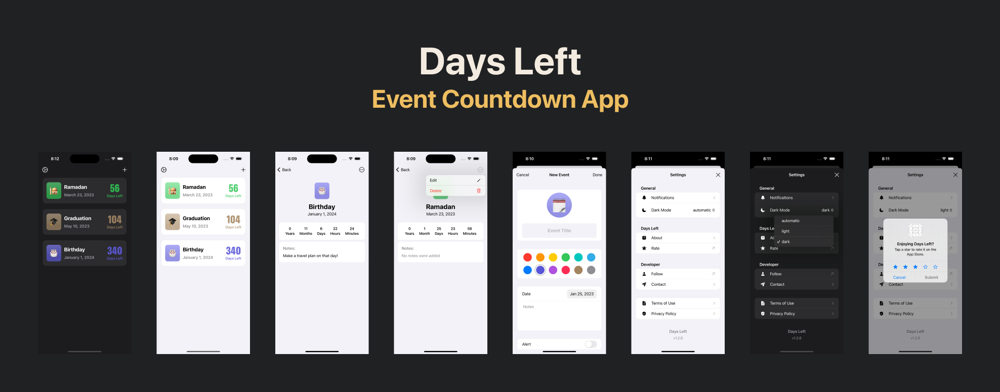

# Demo
Watch the video on 

# Technologies
- SwiftUI
- Core Data
- Notifications
- StoreKit
- UIKit
- MessageUI

# Features
1. Add new event
2. Set icon, color, name, date, notes, and alert for an event
3. Edit/Delete an event
4. Preview all upcoming events
5. Preview how many years, months, days, hours, and minutes left for an event
6. Light/Dark mode options
7. Send mail to the developer with 4 different subjects
8. Rate the app

# License
**Days Left** is under MIT license. See the [LICENSE](LICENSE) file for more info.
